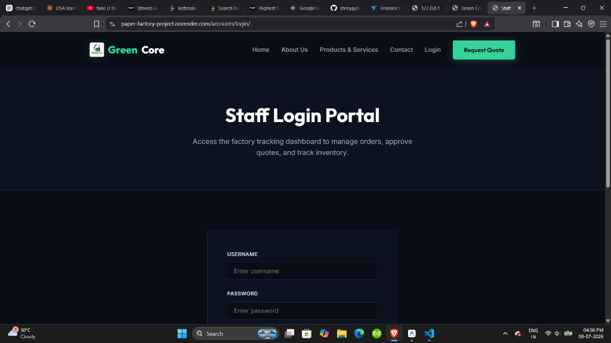
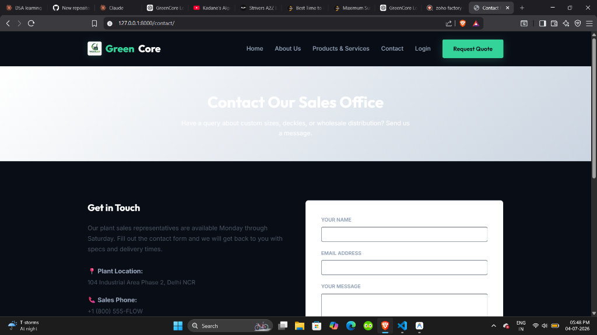
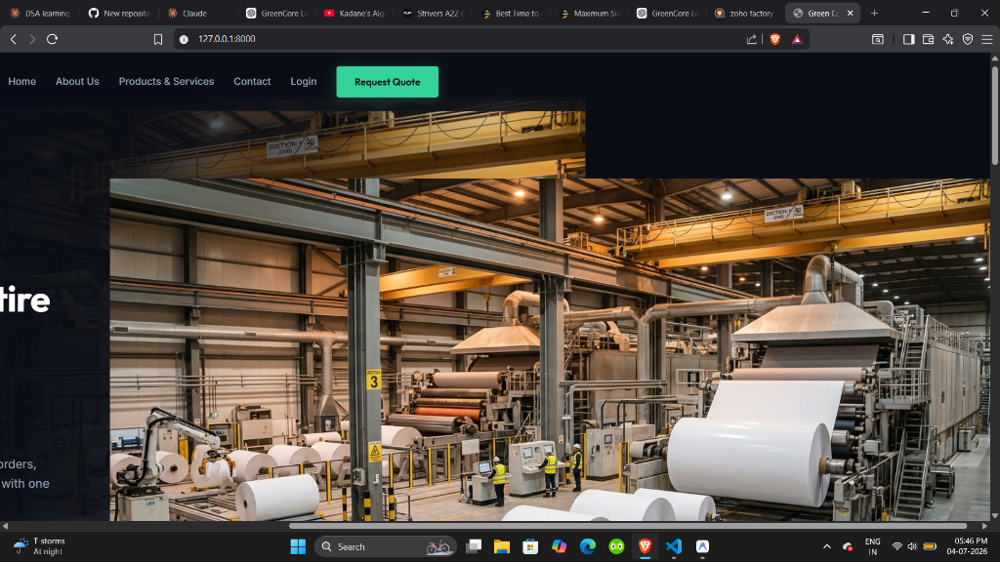

# 🏭 GreenCore – Eco-Industrial Factory Management Portal

[](https://www.python.org/)
[](https://www.djangoproject.com/)
[](https://render.com/)
[](https://opensource.org/licenses/MIT)

🔗 **Live Website**: [https://paper-factory-project.onrender.com/](https://paper-factory-project.onrender.com/)

GreenCore is a full-stack, secure, role-based internal web application designed for industrial paper manufacturing factories. It digitizes paper product directories, validates and tracks client quotation inquiries, and provides staff members with a real-time production pipeline tracking board and analytical charts.

---

## 🎨 User Interface Showcase

### 1. Staff Login Gateway
The landing page redirects all visitors to a secure login gateway. Django handles authentication checks and routes admins to the root control panel, and staff to the production dashboard.



---

### 2. Main Analytics & Pipeline Dashboard
Features interactive stats counters, quotation review tables (with instant approve/reject actions), and a live visual representation of active manufacturing orders.



---

### 3. Public Landing & Material Configurator
A dark Obsidian & Mint themed interface featuring responsive layouts, and slide-in hover animations.



---

## 🚀 Key Features

* **🔐 Role-Based Access Control**:
  * Any unauthenticated user visiting the root URL `/` is automatically redirected to `/accounts/login/`.
  * **Superusers (Admins)** are redirected straight to the Django `/admin/` workspace.
  * **Staff Members** are redirected to the `/dashboard/` workflow workspace.
* **⚙️ Active Order Pipeline State Machine**:
  * Allows staff to advance orders sequentially: `Received ➔ Production ➔ Dispatched ➔ Delivered`.
  * Generates shipping tracking numbers automatically upon dispatch.
* **📊 Database-Driven Chart.js Analytics**:
  * Displays a live bar chart of order quantities categorised by their active pipeline stages.
* **📦 Product Catalog CRUD UI**:
  * Secure management interface allowing staff to Add, Edit, or Delete product grades from the public catalog.
* **🎨 Separation of Concerns (Zero Inline CSS)**:
  * Built using clean Semantic HTML5 templates, style declarations are strictly separated into structured CSS files (`style.css`, `dashboard.css`) using CSS Custom Variables.

---

## 🛠️ Tech Stack & Dependencies

* **Backend Framework**: Django 6.0.6 (Python 3.14)
* **Production Web Server**: Gunicorn
* **Production Static Serving**: WhiteNoise
* **Database**: PostgreSQL (Production) / SQLite3 (Development)
* **Frontend**: Vanilla HTML5, CSS3, JavaScript, Chart.js

---

## 📂 Project Structure

```text
PaperFactory/
│
├── PaperFactory/         # Django Core Configuration
│   ├── settings.py       # Production & Local Django settings
│   ├── urls.py           # Root URL routing configurations
│   └── wsgi.py           # WSGI entrypoint for Gunicorn
│
├── core/                 # Catalog & Contact Apps
│   ├── models.py         # Category, Product, and Contact tables
│   ├── views.py          # Form views & role-based redirects
│   └── forms.py          # ModelForms for contacts and products
│
├── dashboard/            # Staff Operations App
│   ├── views.py          # Pipeline controllers & CRUD handlers
│   └── urls.py           # Dashboard routes
│
├── static/               # Centralized Assets
│   ├── css/              # style.css & dashboard.css
│   └── images/           # Brand logo and hero graphics
│
├── templates/            # Django HTML Templates
│   ├── registration/     # login.html
│   ├── dashboard/        # dashboard.html, manage_products.html, etc.
│   └── base.html         # Main Layout Template
│
├── screenshots/          # Readme UI Graphics
└── seed_data.py          # Automated database seeding script
```

---

## 💻 Local Setup & Installation

### 1. Clone the repository
```bash
git clone https://github.com/YOUR_USERNAME/Paper-Factory-project.git
cd Paper-Factory-project
```

### 2. Create and activate a Virtual Environment
```bash
python -m venv myenv
# On Windows
myenv\Scripts\activate
# On macOS/Linux
source myenv/bin/activate
```

### 3. Install Dependencies
```bash
pip install -r requirements.txt
```

### 4. Run Migrations & Seed Database
Initialize your SQLite tables and run the seed script to automatically populate your catalog with 6 industrial paper grades:
```bash
python manage.py migrate
python seed_data.py
```

### 5. Create an Admin Account
```bash
python manage.py createsuperuser
```

### 6. Run the local development server
```bash
python manage.py runserver
```
Visit [http://127.0.0.1:8000/](http://127.0.0.1:8000/) in your browser.

---

## ☁️ Deployment on Render

This repository is configured for immediate deployment to **Render.com**.

1. Create a free **PostgreSQL Database** on Render.
2. Create a new **Web Service** on Render and link it to this GitHub repo.
3. Configure the following parameters:
   * **Language**: `Python`
   * **Build Command**: `pip install -r requirements.txt && python manage.py collectstatic --noinput && python manage.py migrate`
   * **Start Command**: `gunicorn PaperFactory.wsgi:application`
4. Add the following **Environment Variables**:
   * `DATABASE_URL`: (Paste your Render PostgreSQL database connection string)
   * `SECRET_KEY`: (A random secure string)
   * `DEBUG`: `False`
5. Click **Create Web Service**!

---

## 📄 License
This project is licensed under the MIT License - see the [LICENSE](LICENSE) file for details.
